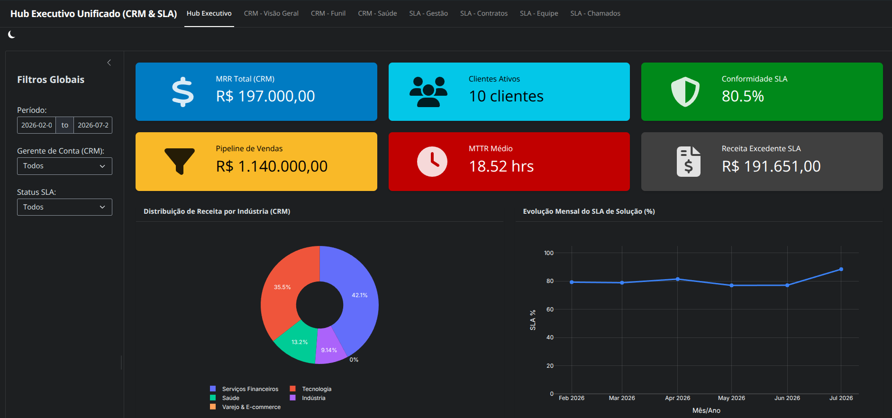

# 🚀 Hub Executivo Unificado: CRM & Acompanhamento de SLA (Posit Shiny)

[](https://shiny.posit.co/py/)
[](https://www.python.org/)
[](https://pandas.pydata.org/)
[](https://plotly.com/python/)
[](https://fastapi.tiangolo.com/)
[](https://www.docker.com/)

---

## 📌 Objetivo do Projeto

Este projeto foi desenvolvido estritamente para fins de **estudo técnico, prática de arquitetura e composição de portfólio profissional** em Engenharia de Software e Data Analytics.

O objetivo principal é demonstrar a construção de um painel web analítico reativo utilizando **Posit Shiny para Python** no frontend e **FastAPI** no backend, integrando a visualização simulada de dados de **Gestão de Relacionamento com Clientes (CRM)** e **Acompanhamento de Acordos de Nível de Serviço (SLA & Contratos de Horas)** em uma única interface com **Navbar Superior** e **troca instantânea de temas Dark/Light Mode**.

> ⚠️ **Aviso Importante:** Todos os dados, métricas, clientes e chamados presentes na aplicação são **100% fictícios**.

---

## 🎯 Estrutura e Funcionalidades Demonstradas



A aplicação organiza a visualização dos dados sintéticos em 8 visões acessíveis pela navbar superior:

### 1. 💼 Módulo CRM (Vendas e Inteligência de Clientes)
- **Visão Geral**: Visualização de métricas financeiras sintéticas (**MRR**, **ARR**, **ACV** / Ticket Médio), distribuição por segmento de mercado e indústria, histograma de Health Score e ranking de Gerentes de Conta.
- **Funil de Vendas**: Pipeline ativo por estágio (*Prospecção, Qualificação, Proposta, Negociação, Fechado-Ganha, Fechado-Perdido*), valor total vs ponderado por probabilidade e tabela de negócios.
- **Saúde dos Clientes**: Indicadores simulados de **NPS**, **Health Score**, identificação de contas em alto risco de churn e matriz de relacionamentos.

### 2. ⏱️ Módulo SLA & Contratos (Operacional e Suporte)
- **Hub Executivo**: Painel integrativo consolidando indicadores gerais de CRM e SLA, evolução mensal do SLA de solução e consumo de horas por cliente.
- **Gestão de SLA**: Indicadores de **MTTA** (*Tempo Médio de 1ª Resposta*) e **MTTR** (*Tempo Médio de Solução*), conformidade de SLA por prioridade (*Crítica, Alta, Média, Baixa*) e listagem de chamados com estouro de prazo.
- **Contratos (Burn Rate)**: Acompanhamento de franquias de horas contratadas vs consumidas, detecção de estouro de contrato e estimativa de faturamento extra.
- **Equipe & Desempenho**: Desempenho simulado de consultores por volume de horas trabalhadas, carga horária média e taxa de cumprimento de SLA.
- **Central de Chamados**: Tabela interativa de tickets de suporte com suporte a busca textual em tempo real.

---

## 🎨 Destaques de Implementação Técnica

- **Navegação por Navbar**: Estrutura modular utilizando `ui.page_navbar()` do Posit Shiny.
- **Alternância de Tema Instantânea (0ms)**: Alternância Dark / Light Mode via `ui.input_dark_mode()`, otimizada no client-side (CSS + MutationObserver JavaScript) para atualizar as cores dos gráficos Plotly em tempo real sem demandar processamento do servidor.
- **Autoajuste de Eixos Plotly (`automargin=True`)**: Margens e eixos Plotly autoajustáveis para evitar o corte de rótulos de clientes e consultores.

---

## 🏗️ Arquitetura do Repositório

```text
crm_sla/
├── app.py                        # Aplicação Posit Shiny (Frontend reativo com Navbar, Dark/Light Mode e Plotly)
├── backend/                      # Servidor FastAPI e serviços de dados em Python
│   ├── data/                     # Data Lake local sintético (mockCrmData.json e CSVs Pandas)
│   ├── routers/                  # Endpoints REST (crm.py e sla.py)
│   ├── services/                 # Regras de agregação Pandas (crm_service.py e sla_service.py)
│   ├── main.py                   # Ponto de entrada FastAPI com Swagger e CORS
│   └── requirements.txt          # Dependências do Backend
│
├── requirements.txt              # Dependências Python globais (Shiny, Plotly, Pandas, Jinja2, FastAPI)
├── Dockerfile                    # Container Docker do Frontend Posit Shiny
├── docker-compose.yml            # Orquestrador containerizado Full Stack (Frontend + Backend)
├── sample.png                    # Imagem demonstrativa do projeto
└── README.md                     # Documentação oficial
```

---

## 🚀 Como Executar Localmente

### 1. Instalar as Dependências

```bash
python3 -m venv venv
source venv/bin/activate   # No Windows: venv\Scripts\activate
pip install -r requirements.txt
```

---

### 2. Executar a Aplicação Posit Shiny (Frontend)

```bash
shiny run app.py --port 5173 --reload
```
- Acesse no navegador: **http://localhost:5173**

---

### 3. (Opcional) Executar a API FastAPI (Backend)

```bash
python3 -m uvicorn backend.main:app --port 8001 --reload
```
- API FastAPI: **http://localhost:8001**
- Swagger UI: **http://localhost:8001/docs**

---

## 🐳 Executar via Docker Compose

Para rodar o ambiente containerizado via Docker Compose:

```bash
docker compose up --build
```

- **Frontend Posit Shiny**: [http://localhost:5173](http://localhost:5173)
- **API FastAPI**: [http://localhost:8001](http://localhost:8001)

---

## 🛠️ Tecnologias Utilizadas

- **Posit Shiny para Python**: Interface web reativa.
- **Plotly Express / Graph Objects**: Visualizações de dados interativas.
- **Pandas & NumPy**: Processamento e manipulação de dados sintéticos.
- **Jinja2**: Engine de renderização de tabelas HTML para DataFrames.
- **FastAPI & Uvicorn**: API RESTful em Python.
- **Docker & Docker Compose**: Containerização e orquestração do ambiente.

---

## 📧 Licença & Finalidade

Desenvolvido exclusivamente para fins de **estudo, prática técnica e portfólio profissional** em Engenharia de Software, Analytics e Data Engineering.
